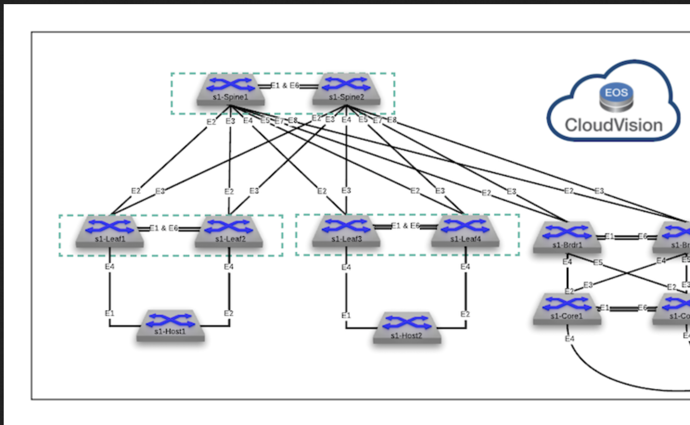

# Deploy L2LS using AVD and CVP
This PoC will allow you to use Arista's AVD automation framework to deploy a single datacenter, layer 2 leaf spine fabric with MLAG and vARP.  Additionally, it incorporates CVP into the CI/CD pipeline for configuration change management and auditing.  The PoC will have you modifying configuration files and implementing the changes yourself using AVD.

## Datacenter Fabric Topology
Below is a network diagram of the portion of the dual datacenter topology you will be working with.  This will include the spines, leafs, and hosts, but not the Brdr and Core leafs.



## Directory Structure and Layout
Since this topology is for two datacenters, the vars and inventory directories and files are broken out per datacenter.  This means there is an inventory file and group_vars directory for each datacenter.  Additionally, since some things are standard across both datacenters, there is a global_vars directory and file.  Finally, the playbooks for building and deploying changes are also split between the datacenters.  The tree structure below outlines all of these items:

### Directory and File Structure
```bash
|---groups_vars
    |---dc1_fabric_ports.yml
    |---dc1_fabric_services.yml
    |---dc1_fabric.yml
    |---dc1_hosts.yml
    |---dc1_leafs.yml
    |---dc1_spines.yml
    |---dc1.yml
|---lab guide
    |---Lab 1 - Leaf Onboarding.md
    |---Lab 2 - VLAN Management.md
    |---Lab 3 - Management ACL.md
    |---Lab 4 - Port Profiles.md
    |---Lab 5 - Dot1x.md
|---playbooks
    |---build.yml
    |---deploy_cvp.yml
    |---deploy_eapi.yml
|---inventory.yml
|---ansible.cfg
|---Makefile
|---README.md
```

# Getting AVD going in the ATD programmability IDE
From your ATD environment, launch the programmability IDE, enter the password, and launch a new terminal:


## STEP #1 - Install deepmerge

- From the terminal session, run the following command.

``` bash
pip install deepmerge
```

## STEP #2 - Clone Necessary Repos

- Change working directory. The following commands will be executed from here.

``` bash
cd labfiles
```

- Install the AVD collection

``` bash
ansible-galaxy collection install arista.avd --force
```

- Clone the POC Repo

``` bash
git clone https://github.com/PacketAnglers/atd-avd-l2ls.git
```

- At this point you should see the `atd-avd-l2ls` directory under the labfiles directory.

## STEP #3 - Update Passwords and SSH Keys

The ATD Lab switches are preconfigured with MD5 encrypted passwords.  AVD uses sha512 passwords so we need to convert the current MD5 password to sha512.  **You will need to login to a switch to do this step.**

From the Programmibility IDE Explorer:

- Navigate to the `labfiles/atd-avd-l2ls/group_vars` folder.
- Double click on the `**dc1.yml**` file to open an editor tab.
- Update lines 4, 48, and 49.  **Follow** instructions per line below.

### Update Line 7

- Update `ansible_password` key (line 7) with your unique lab password found on the **Usernames and Passwords** section of your lab topology screen.

``` yaml
# group_vars/datacenter.yml
#
# Credentials for CVP and EOS Switches
ansible_password: XXXXXXXXXXX
```

### Update Lines 51 & 52

- First, convert the current `arista` username type 5 password to a sha512 by running the following commands on one of your switches. Substitute XXXXXXX with your Lab's unique password.

``` bash
config
username arista privilege 15 role network-admin secret XXXXXXXX
```

- Retrieve password and ssh key for user `arista`.

``` bash
show run section username | grep arista
```

- Update the sha512_password and ssh_key with the above values. _Remember to keep the double quotes and DO NOT REMOVE `ssh-rsa` from the ssh_key._

- line 51 - `sha512_password:`
- line 52 - `ssh_key:`

Your file should look similar to below.  Use values your show command output above, as they are unique to your switches.

``` yaml
# dc1/group_vars/dc1.yml
#
# local users to be configured on switch
local_users:
  arista:
    sha512_password: "XXXXXXXXXXXXXX"
    ssh_key: "ssh-rsa XXXXXXXXXXXXXXXXXXX"
```

## Change directory to the actual repo
``` bash
cd atd-avd-l2ls
```

## Building/Deploying Configurations & Labs Info

<br>

This AVD topology includes three labs, with tasks that show Day 2 operations using AVD on a L2LS fabric.  These labs are located in the **lab guide** directory, in the files starting with `Lab 1 - 3`.  You can view these labs in the easily readable MarkDown format within the IDE by right clicking the lab file, and clicking **Open Preview**.  You can also view them natively in github.

Prior to working on these labs, you will need to deploy the initial data center fabric, after you have modified the `ansible_password` as shown above.  The deployment of fabric, both initially, and of any changes, are all performed via running the appropriate ansible playbook, against the correct site inventory file.  To ease this process, alias commands are available to use via the included Makefile, which run the correct ansible playbook against the correct inventory file, using an abbreviated `make command`.

Below is a description of all the available make file commands, what their purpose is, as well as which ansible playbook and inventory file they control.  

<br>


**Command:**  `make build`

```bash
build: ## Build AVD Configs
	ansible-playbook playbooks/build.yml
```
**Playbook Called:**  `build.yml`

**Inventory File:**  `inventory.yml`

**Description:** This command invokes AVD to build the device configurations for all devices in the fabric.  The playbook ingests everything defined in the various yml files in the group_vars directory.  It then creates the `intended/configs`, `intended/structured_configs`, and `documentation` directories.  Finally, it generates the all device configs, structured configs, and markdown documentation files.

<br>
<br>


**Command:**  `make deploy_cvp`

```bash
deploy_cvp: ## Build AVD Configs
	ansible-playbook playbooks/deploy_cvp.yml
```
**Playbook Called:**  `deploy_cvp.yml`

**Inventory File:**  `inventory.yml`

**Description:** This command invokes AVD to deploy the created configurations, and make the necessary container changes in CVP.  The playbook calls the deploy_cvp role, modifying the CVP container structure if necessary, uploading the created configuration to CVP as configlets, and deploying those configlets to the relevant devices in datacenter1.  The playbook also has a flag called `execute_tasks: true`, which tells CVP to automatically create a change control for the created tasts, and execute them without user intervention.

<br>
<br>


**Command:**  `make deploy_eapi`

```bash
deploy_eapi: ## Deploy AVD configs via eAPI
	ansible-playbook playbooks/deploy_eapi.yml
```
**Playbook Called:**  `deploy_eapi.yml`

**Inventory File:**  `inventory.yml`

**Description:** This command invokes the eos_config module to deploy the created configurations only on applicable devices in the fabric, bypassing CVP and using the device eAPIs.  This playbook show an alternative way to use automation and AVD, without CVP for managing configurations.


<br>
<br>

### Initial Configuration Build & Deployment

Follow the below steps of which make commands to run to build the initial fabric using AVD.

1) Build datacenter configs:  `make build`
5) Deploy datacenter configs via CVP:  `make deploy_cvp`
    1) login to cvp and watch the tasks and change control screens to see the tasks auto-created and executed.
7) Login to switch CLIs and verify configs and operation.
8) Continue on with labs in the `lab guide` directory.
